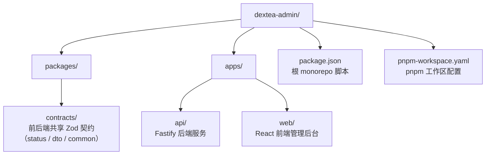

# DexTea Admin 文档

本目录包含 DexTea Admin 项目的全部文档。

## 文档列表

### 入门与部署

| 文档 | 说明 |
| --- | --- |
| [getting-started.md](./getting-started.md) | 快速启动：环境要求与本地启动步骤 |
| [configuration.md](./configuration.md) | 运行配置指南：环境变量、数据库、Redis、对象存储等 |

### 架构与底层专题

| 文档 | 说明 |
| --- | --- |
| [architecture.md](./architecture.md) | 系统架构：技术栈、分层设计、模块划分与数据流 |
| [redis-distributed-lock.md](./redis-distributed-lock.md) | 基于 Redis 的分布式锁分析与保障方案 |

## 项目仓库结构

返回 [根目录 README](../README.md)。
