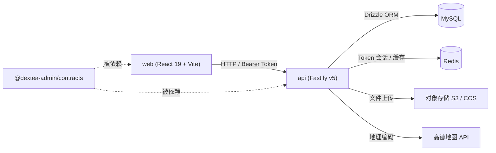
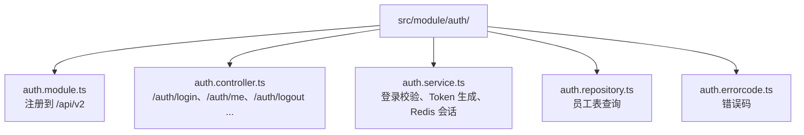

# 系统架构

本文档介绍 DexTea Admin 的整体架构、技术选型、分层设计与模块划分。

## 1. 总体概览

DexTea Admin 采用 **pnpm monorepo** 多包架构，将「共享契约」「后端」「前端」分离，既保证类型与校验规则在前后端之间完全一致，又便于独立开发与构建。

`contracts` 包同时被 `api` 与 `web` 依赖（通过 `workspace:*`），是前后端之间的「单一事实来源（single source of truth）」。

## 2. 技术栈

详见 [根目录 README](../README.md#技术栈一览)。

## 3. 共享契约包（`packages/contracts`）

契约包以 Zod v4 为核心，提供三类导出（见 `src/index.ts`）：

- `common/`：统一响应体 `ApiResponse` / `ApiResponseSchema` 与分页结构 `PaginatedData` / `PaginatedDataSchema`。
- `status/`：各类业务状态枚举，遵循统一约定：
  - `key`：稳定字符串键（用于序列化 / 枚举标识）
  - `label`：中文语义（界面展示，禁止直接展示数字）
  - `value`：数字值（数据库存储 / 接口传输）
  - 同时导出 `*_VALUES`、`*_LABEL`、前端展示样式类（`*_TEXT_CLASSES` / `*_BADGE_CLASSES`）等派生工具。
  - 示例：`EMPLOYEE_STATUS`（禁用 `0` / 激活 `1`）、`ROLE_STATUS` 等。
- `dto/`：各业务模块请求 / 响应的 Zod schema（如 `auth.ts`、`product.ts`、`menu.ts` 等）。

该包使用 `tsc` 编译为 `dist/`，并以 `exports` 字段暴露 `.`、`/status`、`/dto` 三个子路径。

## 4. 后端架构（`apps/api`）

### 4.1 启动流程

入口 `src/index.ts` 的启动顺序：

1. 创建 Fastify 实例并启用 `ZodTypeProvider`。
2. 注册全局校验 / 序列化编译（`fastify-type-provider-zod`）。
3. 注册 CORS（来源取自 `CORS_ORIGIN`）。
4. 注册 MySQL 连接池（`plugins/db/mysql`）与 Redis（`plugins/db/redis`）。
5. 注册 Swagger / Swagger UI（文档路由 `/api/v2/docs`）。
6. 设置全局错误处理与参数校验错误格式化（`common/exception` / `common/handler`）。
7. 注册全局认证钩子 `authHook`（`middleware/auth.ts`）。
8. 注册全部业务模块（`register-modules.ts`）。
9. 监听 `PORT` / `HOST` 启动服务。

### 4.2 分层设计

每个业务模块位于 `src/module/<name>/`，采用 **controller / service / repository** 三层结构：

| 文件 | 职责 |
| --- | --- |
| `*.module.ts` | 模块注册入口（`FastifyPluginAsyncZod`），挂载路由前缀 `/api/v2` |
| `*.controller.ts` | 路由与 HTTP 层，仅做参数接收、调用 service、包装 `ApiResponse` |
| `*.service.ts` | 业务逻辑（事务、跨表、调用插件等） |
| `*.repository.ts` | 数据访问层，封装 Drizzle 对 `mysqlTable` 的 CRUD |
| `*.errorcode.ts` | 模块内业务错误码定义（配合 `BizError`） |

以 `auth` 模块为例：

### 4.3 认证与鉴权

- **认证**：登录成功后由 `auth.service.ts` 生成 Token，并以 `TOKEN_PREFIX + token` 为键写入 Redis（滑动过期 `TOKEN_TTL`）。
- **全局钩子** `authHook`（`middleware/auth.ts`）在 `preValidation` 阶段：
  - 对白名单路径（`/health`、`/api/v2/auth/login`、`/api/v2/init`、`/api/v2/docs`）放行；
  - 否则校验 `Authorization: Bearer <token>`，命中 Redis 会话后将用户信息（`userId / email / displayName / roles / permissions`）注入 `request.authEmployee`；
  - 每次访问成功都会 `expire` 刷新 Token 有效期（滑动过期）。
- **鉴权**：基于 `roles` 与 `permissions` 实现 RBAC；内置「超级管理员」角色与 `*` 超级权限（`init.presets.ts`）。

### 4.4 插件（`src/plugins`）

- `db/mysql`：Drizzle 连接池与表结构（`schema.ts` 定义约 26 张表）。
- `db/redis`：Redis 客户端（会话 / 缓存）。
- `storage`：对象存储抽象（`storage.interface.ts` + `s3.adapter.ts`），基于 AWS S3 SDK，兼容 COS / MinIO。
- `mail`：基于 Nodemailer 的邮件发送。
- `password`：基于 `argon2` 的密码哈希 / 校验。
- `geocode`：高德地图 Web 服务地理编码。
- `lock`：分布式锁（基于 Redis，详见 [基于 Redis 的分布式锁](./redis-distributed-lock.md)）。

### 4.5 API 模块划分

`register-modules.ts` 注册了以下业务模块（每个模块对应 Swagger 的一个 tag）：

员工（Employees）、认证（Auth）、顾客（Customers）、角色（Roles）、权限（Permissions）、门店（Stores）、商品（Products）、菜单（Menus）、原料（Ingredients）、客制化（Customizations）、标签（Tags）、图库（Gallery）、行政区划（Areas）、仪表盘（Dashboard）、系统配置（Config）、系统初始化（Init）、门店目录（StoreCatalog）。

### 4.6 数据模型（MySQL）

`schema.ts` 通过 Drizzle 定义约 26 张表，核心实体包括：

- 组织与权限：`employees`、`employee_roles`、`roles`、`role_permissions`、`permissions`、`config`
- 门店与目录：`stores`、`store_menus`、`store_ingredients`、`store_catalog` 相关、`customization_options`（`customization_option_store_status`）
- 商品与菜单：`products`、`product_tags`、`product_tag_map`、`product_images`、`product_ingredients`、`product_store_status`、`menus`、`menu_groups`、`menu_products`、`customizations`、`customization_options`
- 原料与库存：`ingredients`
- 业务记录：`customers`、`gallery`、`orders`、`order_items`

> 表结构以 `apps/api/src/plugins/db/mysql/schema.ts` 为准，可配合 `drizzle-kit` 进行迁移 / 生成。

## 5. 前端架构（`apps/web`）

### 5.1 技术要点

- **React 19 + Vite 8 + TypeScript**，使用 `BrowserRouter`（`react-router-dom` v7）做客户端路由。
- **Tailwind CSS v4** 负责样式，`shadcn`（基于 Base UI）提供组件，图标用 `lucide-react`，消息提示用 `sonner`。
- 路径别名 `@` → `src/`（`vite.config.ts` 与 `tsconfig` 中统一配置）。

### 5.2 目录结构（`src/`）

| 目录 | 说明 |
| --- | --- |
| `pages/` | 各业务页面（Login、Dashboard、Employees、Roles、Permissions、Stores、Products、Menus、Ingredients、Customers、Gallery、Me、Initialization、Forbidden 等） |
| `components/` | 通用组件与 UI 组件（含 `layout/AppLayout`、`auth/ProtectedRoute`） |
| `api/` | 按模块拆分的 Axios 客户端（`client.ts` 提供 `createModuleClient`）、各模块接口封装 |
| `hooks/` | 自定义 Hook（如 `use-theme` 主题） |
| `lib/` | 工具函数（如 `cn` 类名合并） |
| `assets/`、`types/` | 静态资源与类型定义 |

### 5.3 请求层

`api/client.ts` 为每个业务模块创建独立的 `AxiosInstance`（按 `ModuleKey` 缓存复用）：

- 各模块 Base URL 取自 `.env` 中对应的 `VITE_API_<MODULE>_BASE_URL`，缺失时回退到 `http://localhost:3001/api/v2`。
- 请求拦截器自动附加 `Bearer` Token（存于 `sessionStorage`）。
- 响应拦截器统一处理业务错误（`code !== 0`）、401 跳转登录、403 跳转无权限页、网络异常提示。
- 业务模块接口封装（如 `api/employee.ts`）复用 `contracts` 包中的 DTO 类型。

### 5.4 路由与鉴权

`App.tsx` 定义路由：

- 公开路由：`/login`、`/initialization`（系统首次初始化）。
- 受保护路由（`<ProtectedRoute>` 包裹，`AppLayout` 布局）：仪表盘、员工、角色、权限、门店、商品、菜单、原料、标签、顾客、图库、个人中心等。
- 未匹配路由重定向到首页。

## 6. 数据流（一次登录请求）

1. 前端 `pages/Login` 调用 `api/auth` 的登录接口。
2. 后端 `auth.controller` → `auth.service` 校验密码（`argon2`）→ 生成 Token 并写入 Redis。
3. 前端保存 Token 到 `sessionStorage`，后续请求自动携带。
4. 后端 `authHook` 校验 Token 并刷新 Redis TTL，注入 `request.authEmployee`。
5. 业务接口基于 `authEmployee.roles / permissions` 做 RBAC 鉴权，返回 `ApiResponse` 统一结构。

---

返回 [文档索引](./README.md)。
