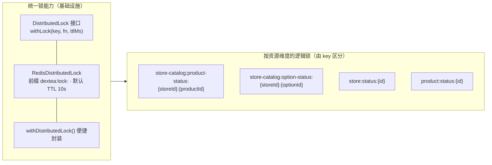
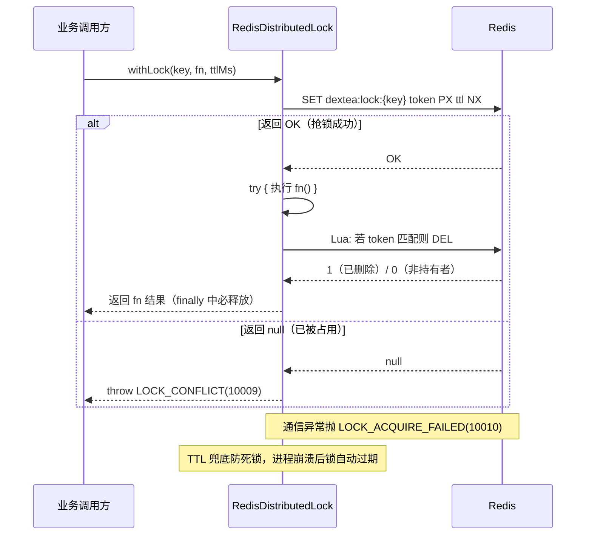
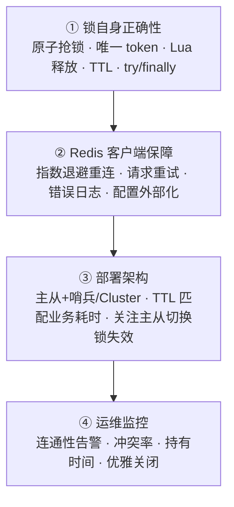

# 基于 Redis 的分布式锁分析与保障方案

> [返回文档索引](./README.md) · [返回根目录](../README.md)

本文档分析 `dextea-admin` 项目中基于 Redis 实现的分布式锁，并说明如何保障其正常运行。

涉及的核心文件：

- 锁实现：`apps/api/src/plugins/lock/index.ts`
- Redis 客户端：`apps/api/src/plugins/db/redis/index.ts`
- 错误码：`apps/api/src/common/constants/error-code.constant.ts`
- 使用方：`apps/api/src/module/stores/store.service.ts`、`apps/api/src/module/store-catalog/store-catalog.service.ts`

---

## 一、项目中共有哪些分布式锁

本项目**只实现了一套统一的分布式锁能力**，对外暴露一个可插拔的 `DistributedLock` 接口与一个便捷函数 `withDistributedLock`。所有业务侧加锁都复用这一套机制，只是**锁键（key）按资源维度不同**而区分出多个“逻辑锁”。



### 1. 统一锁能力（基础设施）

位于 `apps/api/src/plugins/lock/index.ts`：

- `DistributedLock` 接口：定义 `withLock<T>(key, fn, ttlMs)` 方法，调用方不感知底层实现。
- `RedisDistributedLock`：基于 Redis 的唯一实现，前缀 `dextea:lock:`，默认 TTL `10_000ms`。
- `withDistributedLock(...)`：对外便捷封装，内部调用 `distributedLock.withLock`。
- 单例 `distributedLock`：当前固定为 `RedisDistributedLock`，注释明确说明未来可替换为数据库锁 / ZooKeeper / etcd 等后端而无需改动调用方。

### 2. 按资源维度的逻辑锁（使用侧）

通过不同的 `key` 拆分出以下三类锁：

| 锁键（key） | 用途 | 代码位置 |
| --- | --- | --- |
| `store-catalog:product-status:{storeId}:{productId}` | 门店-商品上/下架状态更新，防止同一商品并发写 | `store-catalog.service.ts:27` |
| `store-catalog:option-status:{storeId}:{optionId}` | 门店-自定义项上/下架状态更新，防止同一选项并发写 | `store-catalog.service.ts:57` |
| `store:status:{id}` | 门店自身状态变更，防止同一门店并发更新 | `store.service.ts:142` |
| `product:status:{id}` | 商品全局上/下架状态更新，防止同一商品并发写（含 `updateProductStatus` 与 `updateProduct` 触发状态变更两条路径） | `product.service.ts` |

> 所有 key 在底层都会被统一加上 `dextea:lock:` 前缀，例如最终 Redis 中的键为 `dextea:lock:store:status:123`。

三类锁的共性：

- 都是**细粒度资源锁**（精确到“门店 + 商品/选项”或“门店”），不同资源互不影响，并发度高。
- 都是**写保护锁**：只对 `upsert/update` 类写操作加锁，读操作（list 系列）不加锁。
- 都是**就地调用**：在 service 层用 `withDistributedLock(...)` 包裹写操作，失败即抛业务异常，由上层返回友好提示。

---

## 二、锁的实现机制分析



### 1. 获取锁：原子 SET + NX + PX

```41:41:apps/api/src/plugins/lock/index.ts
const result = await redis.set(`${LOCK_PREFIX}${key}`, token, 'PX', ttlMs, 'NX');
```

- 使用 `SET key value PX ttl NX` 单条命令，**原子地**完成“不存在才写入 + 设置过期时间”，避免“先 SET 再 EXPIRE”两步竞态导致的死锁。
- `token` 由 `process.pid + Date.now() + 随机串` 组成，**全局唯一**，用于释放时校验“锁仍属于自己”。
- 返回 `OK` 表示抢锁成功；返回 `null`（已被占用）则抛 `LOCK_CONFLICT(10009)`。

### 2. 释放锁：Lua 脚本原子校验删除

```50:57:apps/api/src/plugins/lock/index.ts
const script = `
  if redis.call('get', KEYS[1]) == ARGV[1] then
    return redis.call('del', KEYS[1])
  end
  return 0
`;
await redis.eval(script, 1, `${LOCK_PREFIX}${key}`, token);
```

- 用 Lua 脚本保证“判断 token 相等”和“删除”是一个原子操作，避免 `GET` 后、`DEL` 前锁过期被他人持有的竞态（即**误删他人锁**）。
- 只有 token 匹配时才删除，否则返回 0（不操作）。

### 3. 防死锁与资源释放

```30:34:apps/api/src/plugins/lock/index.ts
try {
  return await fn();
} finally {
  await this.release(key, token);
}
```

- **TTL 兜底**：即使进程崩溃、未执行 `finally`，锁也会在 `ttlMs`（默认 10s）后自动过期，不会永久死锁。
- **try/finally 兜底**：正常路径下，无论业务成功或抛错，都会执行释放，避免长期占用。
- **释放失败容忍**：`release` 的 catch 吞掉异常（仅打日志由 Redis error 监听处理），不阻断主流程，因为锁最终会随 TTL 过期。

### 4. 获取锁失败的容错

```43:44:apps/api/src/plugins/lock/index.ts
} catch {
  throw new BizError(SystemErrorCodes.LOCK_ACQUIRE_FAILED);
}
```

- 与 Redis 通信异常时抛 `LOCK_ACQUIRE_FAILED(10010)`，与“锁被占用”(`LOCK_CONFLICT`) 区分，便于前端/调用方区分“稍后重试”与“服务异常”。

---

## 三、如何保障 Redis 分布式锁的正常运行

下面从**锁设计、Redis 客户端、部署架构、监控与运维**四个层面说明保障手段，并给出已知局限与改进建议。



### 1. 锁自身的正确性保障（已实现）

- **原子抢锁**：`SET ... NX PX` 单命令，避免“SET + EXPIRE”竞态死锁。
- **唯一 token + Lua 释放**：防止误删他人锁。
- **TTL 自动过期**：防止持有者崩溃导致的死锁。
- **try/finally 必释放**：正常路径及时归还锁，提升并发吞吐。
- **可插拔抽象**：`DistributedLock` 接口隔离实现，单测可替换为内存锁，也便于未来升级到更强后端。

### 2. Redis 客户端连接保障（已实现）

位于 `apps/api/src/plugins/db/redis/index.ts`：

- **断线重连**：`retryStrategy` 指数退避（每次 `min(times*100, 3000)` ms，最长 3s），避免雪崩式重连。
- **请求级重试**：`maxRetriesPerRequest: 3`，单条命令失败自动重试，提升瞬时抖动下的成功率。
- **错误可观测**：监听 `redis.on('error')` 打印 `[Redis] 连接错误` 日志，便于发现连接问题。
- **配置外部化**：host/port/password/db 全部来自环境变量（`REDIS_HOST`/`REDIS_PORT`/`REDIS_PASSWORD`/`REDIS_DB`），部署可通过配置切换，不改代码。

### 3. 部署架构层面（建议 / 取决于基础设施）

当前客户端是**单个 Redis 实例**连接，锁的正确性依赖该实例的可用性。为保障“正常运行”需关注：

- **Redis 高可用**：生产环境应部署**主从 + 哨兵**或 **Redis Cluster**，避免单点故障导致锁服务整体不可用（`registerRedis` 默认 `closeClient: true`，会在 Fastify 关闭时优雅释放连接）。
- **时钟与 TTL 设定**：锁 TTL（默认 10s）应大于“业务函数 `fn` 的最坏执行时间”。如果 `fn` 偶发慢查询超过 10s，可能出现“锁过期 → 另一实例进入 → 并发写”的问题。建议按实际业务耗时调大 `ttlMs`，或引入**看门狗自动续期**（见下）。
- **主从切换的锁安全（重要局限）**：异步复制的主从架构下，主节点刚写入锁即宕机、锁尚未同步到从节点，哨兵切换后新主没有该锁，可能出现**锁失效（双写）**。这是单命令锁的固有局限。若要严格保证，可采用：
  - **Redlock 多节点算法**（向 ≥5 个独立 Redis 主节点多数派加锁），或
  - **强一致存储**（如 etcd/ZooKeeper 的临时节点），本项目已预留 `DistributedLock` 接口便于替换。

### 4. 运维与监控建议

- **监控 Redis 连通性**：利用已有的 `error` 日志接入告警，Redis 不可达会触发 `LOCK_ACQUIRE_FAILED`。
- **监控锁冲突率**：`LOCK_CONFLICT(10009)` 出现频率可反映热点资源竞争；若某资源冲突率过高，需评估是否拆分锁粒度或合并写操作。
- **监控锁持有时间**：若大量请求因锁 TTL 内未释放而冲突，说明 `fn` 执行偏慢，应优化 `fn` 或增大 TTL。
- **优雅关闭**：Fastify 关闭时 `closeClient: true` 会断开 Redis，需确保进程退出前不再有新的加锁请求进入（配合健康检查 / 摘流）。

### 5. 已知局限与改进清单

| 局限 | 影响 | 建议 |
| --- | --- | --- |
| 无看门狗自动续期 | 业务超 TTL 可能被并发进入 | 引入后台续期线程，或按业务耗时设合理 TTL |
| 单实例/主从复制 | 主宕机未同步可能锁失效 | 升级 Redlock 或多实例多数派；或换 etcd/ZK |
| TTL 为固定值 | 不同业务耗时不同，统一 10s 可能偏大/偏小 | 调用处按业务传 `ttlMs` 覆盖默认值 |
| 释放失败静默吞掉 | 极端情况下锁释放异常无告警 | 在 catch 中补一条 warn 日志便于排查 |

---

## 四、小结

- 本项目**只有一套**基于 Redis 的分布式锁实现（`RedisDistributedLock`），通过 `dextea:lock:` 前缀 + 不同资源 key 衍生出“门店状态锁、商品状态锁、自定义项状态锁”三类逻辑锁。
- 锁具备**原子抢锁、唯一 token、Lua 原子释放、TTL 防死锁、try/finally 必释放**等正确性保障。
- 正常运行的保障依赖于：锁自身设计 + ioredis 重连/重试配置 + 外部化的 Redis 高可用部署 + 日志监控；在当前单实例/主从架构下需重点关注 **TTL 与业务耗时的匹配**以及**主从切换锁失效**两个风险点，必要时通过 Redlock 或换更强后端兜底。

---

返回 [文档索引](./README.md)。
